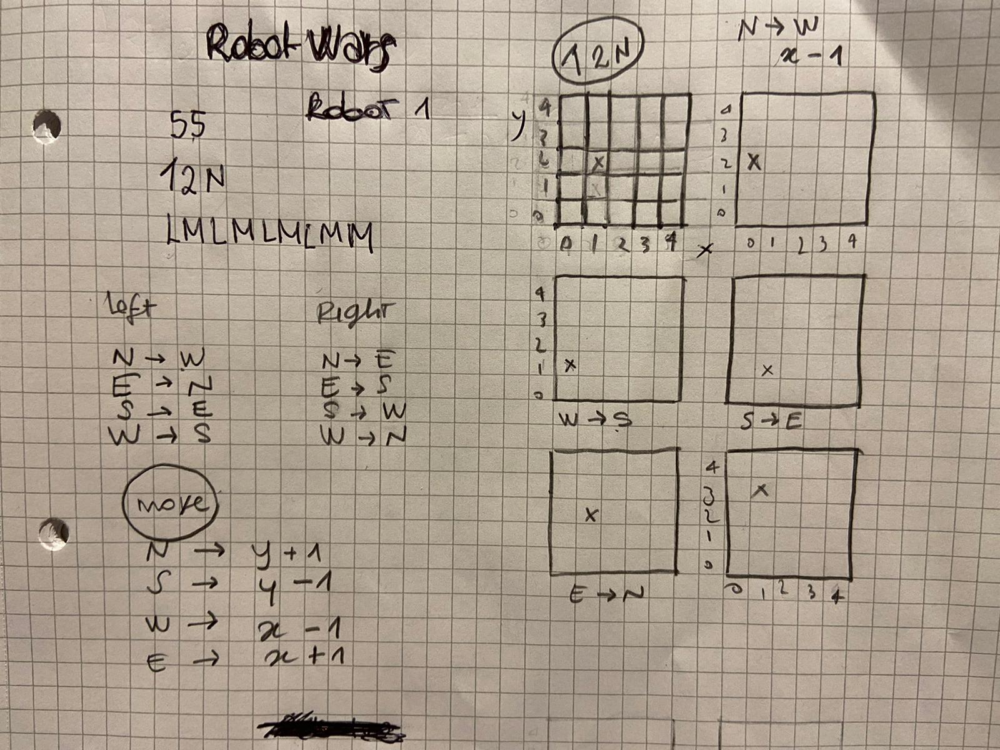
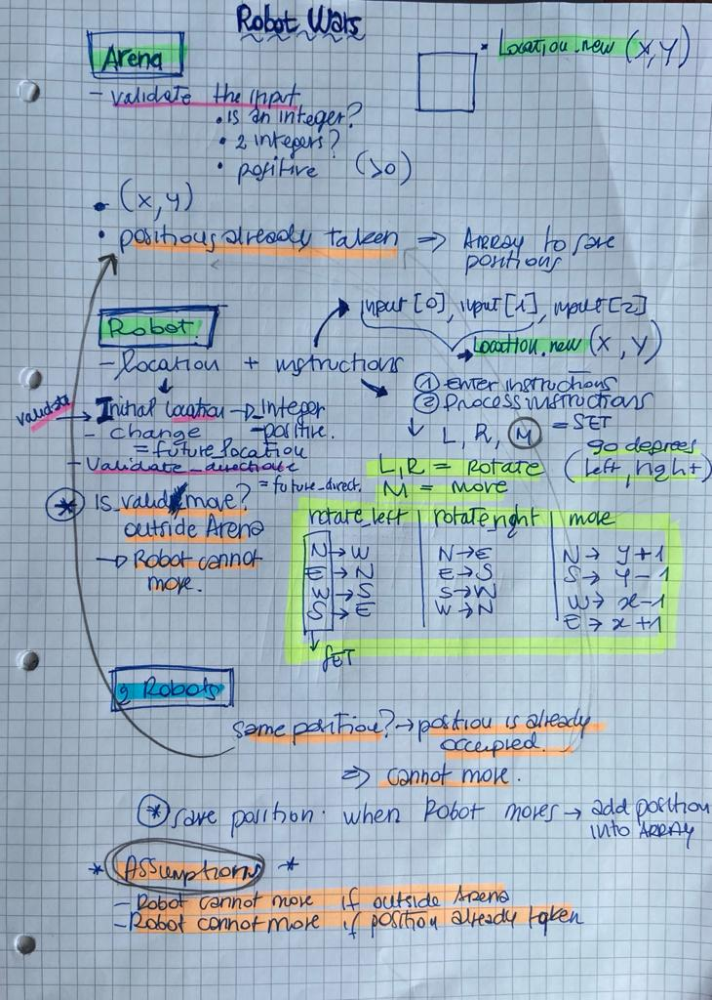

# Robot Wars
### Requirements
A fleet of hand-built robots are due to engage in battle for the annual “Robot Wars” competition. Each robot will be placed within a rectangular battle arena and will navigate their way around the arena using a built-in computer system.

A robot’s location and heading is represented by a combination of x and y co-ordinates and a letter representing one of the four cardinal compass points. The arena is divided up into a grid to simplify navigation. An example position might be 0, 0, N which means the robot is in the bottom left corner and facing North.

In order to control a robot, the competition organizers have provided a console for sending a simple string of letters to the on-board navigation system. 

The possible letters are ‘L’, ‘R’ and ‘M’. ‘L’ and ‘R’ make the robot spin 90 degrees to the left or right respectively without moving from its current spot while ‘M’ means move forward one grid point and maintain the same heading. Assume that the square directly North from (x, y) is (x, y+1).

### Input
The first line of input is the upper-right coordinates of the arena, the lower-left coordinates are assumed to be (0, 0).

The rest of the input is information pertaining to the robots that have been deployed. Each robot has two lines of input - the first gives the robot’s position and the second is a series of instructions telling the robot how to move within the arena.

The position is made up of two integers and a letter separated by spaces, corresponding to the x and y coordinates and the robot’s orientation. Each robot will finish moving sequentially, which means that the second robot won’t start to move until the first one has finished moving. 

### Output
The output for each robot should be its final coordinates and heading. 

### Acceptance criteria
In order to confirm your program is working correctly, we have provided some test input and output for your use. Implement these details however you consider most appropriate. 


| Test Input | Expected output |
| ---------- | --------------- |
| 5 5<br>1 2 N<br>LMLMLMLMM | 1 3 N|
| 5 5<br>3 3 E<br>MMRMMRMRRM | 5 1 E |
| 5 5<br>1 2 N<br>LMLMLMLMM<br>3 3 E<br>MMRMMRMRRM | 1 3 N<br> 5 1 E |

## Pre-requisites
This program is written in Ruby and it uses the version `ruby 2.6.3p62 (2019-04-16 revision 67580)`. In order to run the program and the test locally, it is required to install Ruby, following the [Ruby official documentation](https://www.ruby-lang.org/en/documentation/installation/).

## Run the program
### How to run

```
git clone https://github.com/lisabardelli/robot_wars.git
cd robot_wars
bundle install
ruby ./lib/main.rb
```

### How to run test

```
git clone https://github.com/lisabardelli/robot_wars.git
cd robot_wars
bundle install
rspec
```

### **Tech Summary**

| Technology    | Use               |
| ------------- | ----------------- |
| Ruby          | Language          |
| RSpec         | Testing Framework |
| RuboCop       | Linting           |
| SimpleCov     | Test coverage     |


## Planning and implementation

### Friday 2nd April
- Understanding of the game
- Playing with the game
- Planning:
1. Identification of classes
2. Thinking of how to validate the input entered by the user in the terminal
3. Thinking of how to move and rotate the robot
4. Introducing the second robot


### Saturday 3rd April

#### Implementation of point 1 (Identification of classes):
1. Arena is the grid where robots can move 
2. Location is equal to a square of the grid
3. String class has been created to evaluate if a string is a non negative integer
4. Robot class is the robot with location and direction attributes and methods to move/rotate

#### Implementation of point 2 (Thinking of how to validate the input entered by the user in the terminal):
- Arena.new(top_right_corner, occupied_locations = [])
    1. is top_right_corner integer?
    2. is top_right_corner positive?
    3. at least 2 values?

- Robot.new(initial_position, instruction)

initial_position:
1. is initial_location a valid location? is integer? is positive? at least 2 values? is inside the arena?
2. is initial_direction a valid direction? is within ['W', 'E', 'S', 'N']? is capitalized?

instruction:
 1. is instruction valid? is within ['L', 'M', 'R']?

#### Implementation of point 3 (Thinking of how to move and rotate the robot):
- How to rotate right (change directions)
- How to rotate left (change directions)
- How to move N, S, W, E (change x and y)


### Monday 4th April

#### Implementation of point 4 (Introducing the second robot):

- Add an array to save the occupied location by a robot 
- Save the current position of the robot into the array
- Delete the position from the array once the robot moves

Second robot's moves to handle:
1. Second robot starts from the location where the first robot is
2. Once second robot moves, it reaches the location where the first robot is


### Assumptions

1. Robot cannot move if it reaches the border of the Arena
2. Robot cannot move if position has already been taken by another robot
3. The arena can only have non-negative (x >= 0 and y>=0) coordinates


### Scratch of game/planning 

